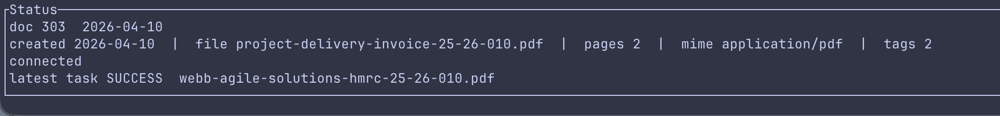

# paperless-cli

`paperless-cli` is now a Rust application with three output modes for
[Paperless-ngx](https://github.com/paperless-ngx/paperless-ngx):

- `tui`: interactive Ratatui dashboard and inspector
- `markdown`: LLM-friendly summaries for humans and agents
- `json`: structured machine-readable output

The Rust binary is now the primary runtime and CI target.

## Install

```bash
cargo build --release
./target/release/paperless --help
```

## Quick start

Configure access with a token:

```bash
paperless login --url https://paperless.example.com --token YOUR_TOKEN
```

Or exchange username and password for a token:

```bash
paperless login --url https://paperless.example.com --username admin --password secret
```

If you omit the URL or auth fields, `paperless login` will prompt for them interactively.

Launch the TUI:

```bash
paperless
```

Launch the built-in demo mode for fast UI feedback without a live Paperless
server or local config:

```bash
paperless --demo
paperless --demo document list
paperless --demo --output json status
```

Request markdown or JSON output:

```bash
paperless --output markdown document list --query "invoice 2024"
paperless --output json search query "invoice acme"
paperless status
```

## TUI overview

The default TUI is a two-pane document browser:

- `Tab` switches focus between the Documents list and the Inspector
- `j/k` or arrows move within the focused pane
- `PgUp/PgDn` page through the focused pane
- `g/G` jump to the top or bottom of the focused pane
- `r` reloads the document list

For fast iteration on layout and keyboard behavior, use `paperless --demo`.



## Command surface

| Area | Commands |
| --- | --- |
| top level | `login`, `status`, default TUI |
| `config` | `set-url`, `set-token` |
| `pdf` | `read`, `info` |
| `project` | `login`, `info`, `ping` |
| `document` | `list`, `get`, `content`, `upload`, `download`, `preview`, `thumb`, `edit`, `update`, `delete`, `search` |
| `search` | `query`, `autocomplete` |
| `task` | `list`, `get` |
| `tag` | `list`, `get`, `create`, `edit`, `delete` |
| `correspondent` | `list`, `get`, `create`, `delete` |
| `doctype` | `list`, `get`, `create`, `delete` |
| `export` | `bulk` |

## Compatibility

The CLI now includes the main compatibility commands and inputs people expect
from [`julianfbeck/paperless-cli`](https://github.com/julianfbeck/paperless-cli):

- `document content <id>` for extracted text only
- `document edit <id> --add-tag ... --remove-tag ...` with exact tag names or IDs
- `tag edit <id> --name ...`
- `pdf read <file>` and `pdf info <file>`
- `config set-url ...` and `config set-token ...`
- `PAPERLESS_URL` and `PAPERLESS_TOKEN` support
- global `--json`, `-q/--quiet`, `--no-color`, and `-u/--url` compatibility flags

See [docs/cli-parity.md](docs/cli-parity.md) for the current compatibility notes.

## Security posture

- Config and session state are stored as TOML under the user config/state
  directories with restricted permissions on Unix.
- Downloaded filenames are sanitized before writing to disk.
- A background security reviewer polls shared runtime state and feeds findings
  back to the main app. Its default model profile is `gpt-5.4`.
- The app avoids shelling out for Paperless operations; all API calls go
  through the Rust client.

## Docs

- [Migration notes](docs/rust-migration.md)
- [Architecture overview](docs/architecture.md)
- [Testing strategy](docs/testing-strategy.md)
- [CLI parity notes](docs/cli-parity.md)
- [Release process](docs/release-process.md)
- [Static docs site](site/index.html)

## Skills

This repo now ships installable repo-local skills:

- [SKILL.md](SKILL.md)
- [skills/paperless-documents/SKILL.md](skills/paperless-documents/SKILL.md)
- [skills/paperless-pdf/SKILL.md](skills/paperless-pdf/SKILL.md)
- [skills/paperless-admin/SKILL.md](skills/paperless-admin/SKILL.md)

## Development

```bash
cargo fmt
cargo clippy --all-targets --all-features -- -D warnings
cargo test
```
